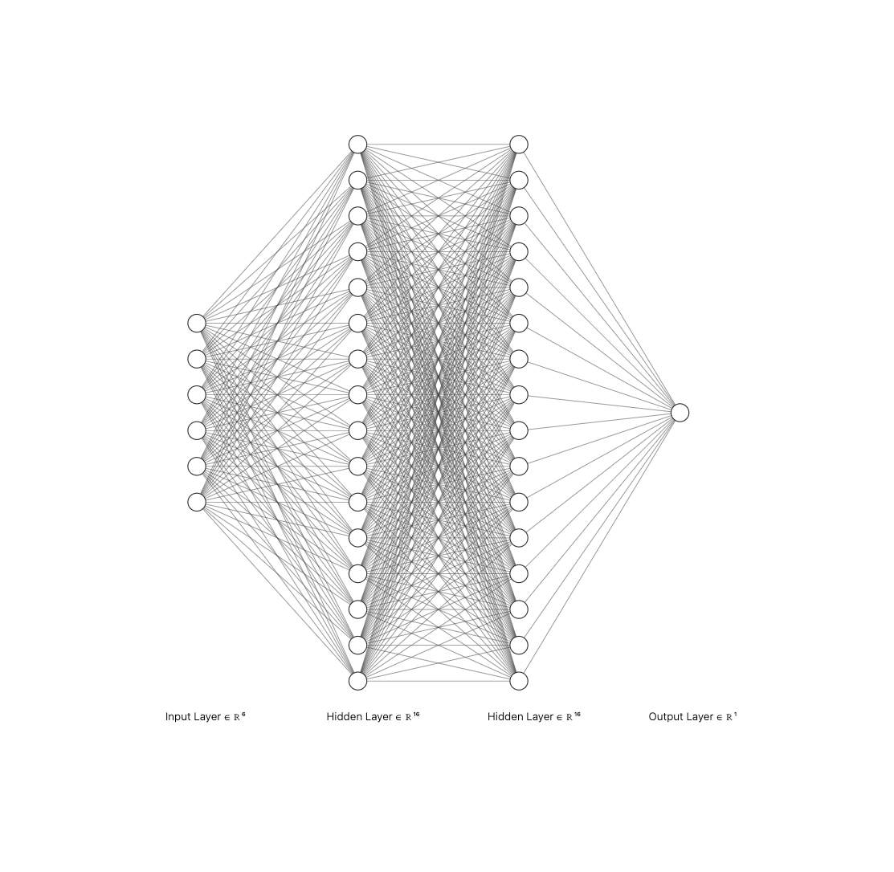

# Creating a Neural Network w/ Keras

### Keras:

Keras is a high-level neural networks API written in Python that serves as an interface for building, training, and deploying deep learning models, providing a user-friendly and modular approach to constructing complex neural networks.

### TensorFlow:

TensorFlow is an open-source machine learning framework developed by Google that facilitates the creation and deployment of machine learning and deep learning models, providing a comprehensive ecosystem for numerical computations, model training, and serving in production environments.

### Pandas:

Pandas is an open-source data manipulation and analysis library for Python, offering data structures like DataFrame for efficient handling and manipulation of structured data, making it a powerful tool for tasks such as data cleaning, exploration, and analysis.

### Dense hidden layer:

A Dense hidden layer in a neural network connects each neuron to every neuron in the previous and next layers, performing a weighted sum on the inputs and applying an activation function.

### ReLU:

Rectified Linear Unit (ReLU) is an activation function commonly used in neural networks

$$
f(x) = \max(0, x)
$$

### Sigmoid:

The sigmoid function is a mathematical function that maps any real-valued number to a value between 0 and 1.

$$
\sigma(z) = \frac{1}{1 + e^{-z}}
$$

